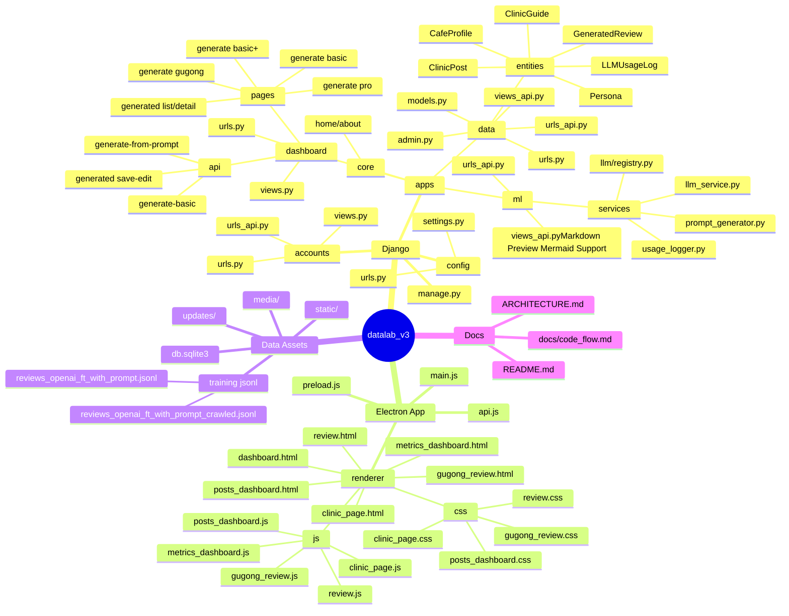
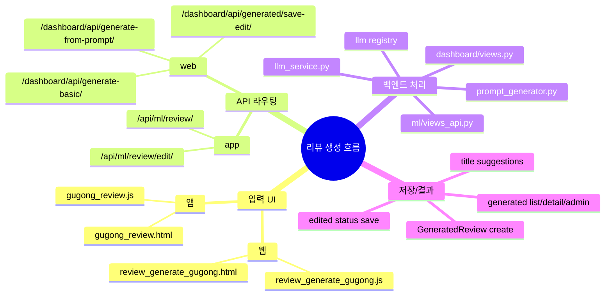
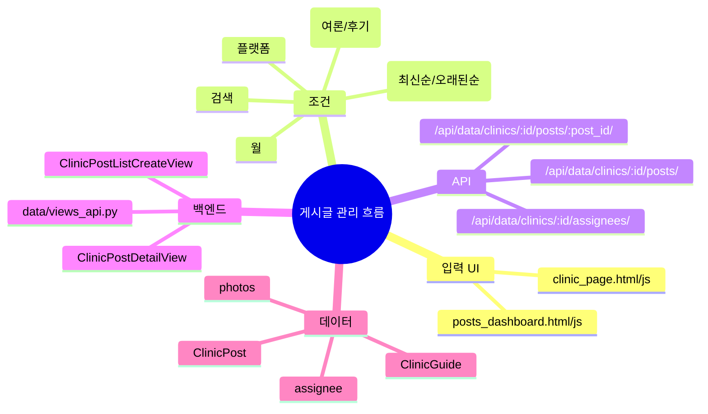

# datalab_v3 전체 마인드맵

아래는 `datalab_v3`를 **마인드맵 형태**로만 정리한 문서입니다.

```mermaid
mindmap
  root((datalab_v3))
    Django
      config
        settings.py
        urls.py
      manage.py
      accounts
        urls.py
        urls_api.py
        views.py
      apps
        core
          home/about
        dashboard
          pages
            generate basic
            generate basic+
            generate pro
            generate gugong
            generated list/detail
          api
            generate-basic
            generate-from-prompt
            generated save-edit
          views.py
          urls.py
        ml
          urls_api.py
          views_api.pyMarkdown Preview Mermaid Support
          services
            prompt_generator.py
            llm_service.py
            llm/registry.py
            usage_logger.py
        data
          urls.py
          urls_api.py
          views_api.py
          models.py
          admin.py
          entities
            ClinicGuide
            ClinicPost
            GeneratedReview
            Persona
            CafeProfile
            LLMUsageLog
    Electron App
      main.js
      preload.js
      api.js
      renderer
        dashboard.html
        clinic_page.html
        posts_dashboard.html
        review.html
        gugong_review.html
        metrics_dashboard.html
        js
          clinic_page.js
          posts_dashboard.js
          review.js
          gugong_review.js
          metrics_dashboard.js
        css
          clinic_page.css
          posts_dashboard.css
          review.css
          gugong_review.css
    Data Assets
      db.sqlite3
      media/
      static/
      updates/
      training jsonl
        reviews_openai_ft_with_prompt.jsonl
        reviews_openai_ft_with_prompt_crawled.jsonl
    Docs
      README.md
      ARCHITECTURE.md
      docs/code_flow.md
```

## 기능 흐름 마인드맵 (리뷰 생성)

```mermaid
mindmap
  root((리뷰 생성 흐름))
    입력 UI
      웹
        review_generate_gugong.html
        review_generate_gugong.js
      앱
        gugong_review.html
        gugong_review.js
    API 라우팅
      web
        /dashboard/api/generate-basic/
        /dashboard/api/generate-from-prompt/
        /dashboard/api/generated/save-edit/
      app
        /api/ml/review/
        /api/ml/review/edit/
    백엔드 처리
      dashboard/views.py
      ml/views_api.py
      prompt_generator.py
      llm_service.py
      llm registry
    저장/결과
      GeneratedReview create
      title suggestions
      edited status save
      generated list/detail/admin
```

## 기능 흐름 마인드맵 (게시글 관리)

```mermaid
mindmap
  root((게시글 관리 흐름))
    입력 UI
      clinic_page.html/js
      posts_dashboard.html/js
    조건
      월
      플랫폼
      유형(여론/후기)
      검색
      정렬(최신순/오래된순)
    API
      /api/data/clinics/:id/posts/
      /api/data/clinics/:id/posts/:post_id/
      /api/data/clinics/:id/assignees/
    백엔드
      data/views_api.py
      ClinicPostListCreateView
      ClinicPostDetailView
    데이터
      ClinicPost
      ClinicGuide
      assignee
      photos
```

